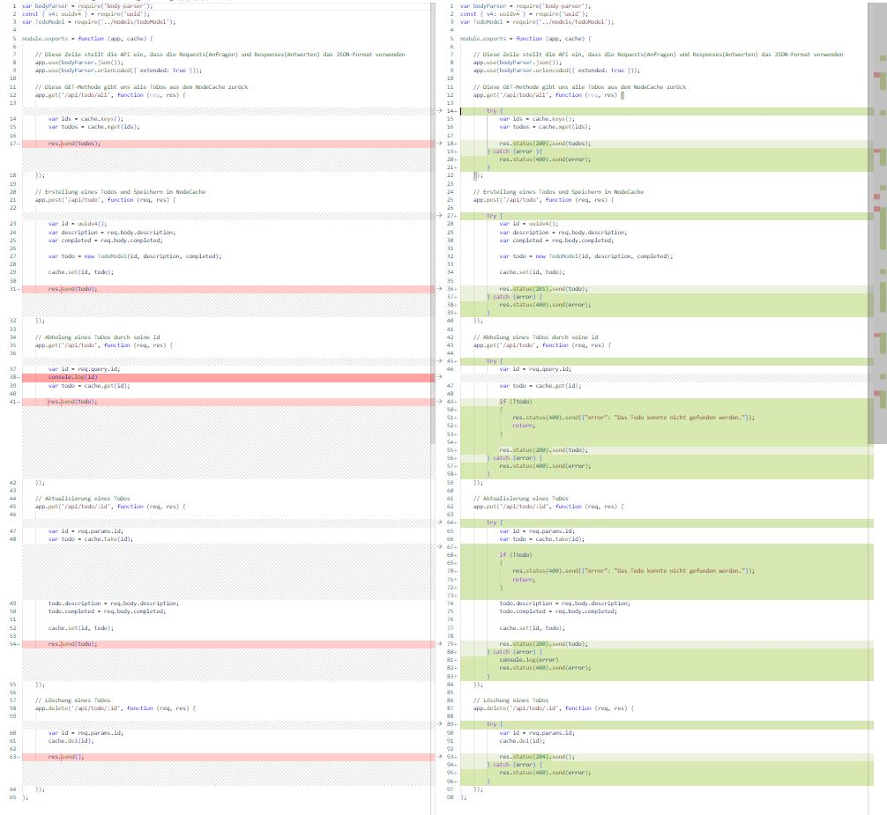

# Erweiterung der API mit HTTP-Statuscodes und Fehlerbehandlung

Die einzigen Änderungen, die in dieser Iteration passiert sind, sind das Hinzufügen von Fehlerbehandlung und HTTP-Statuscodes.

  

Die Links zu den Artikeln für Fehlerbehandlung und Statuscodes sind in der vorherigen Version des Projekts.

Bitte schaut was die Statuscodes in der Tabelle in Wikipedia bedeuten!
